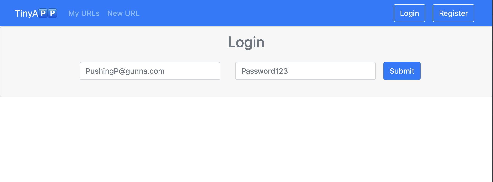
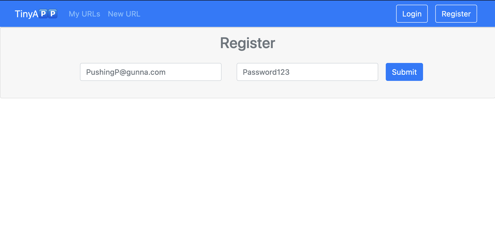
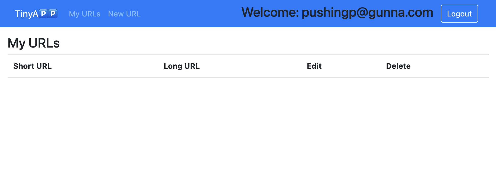
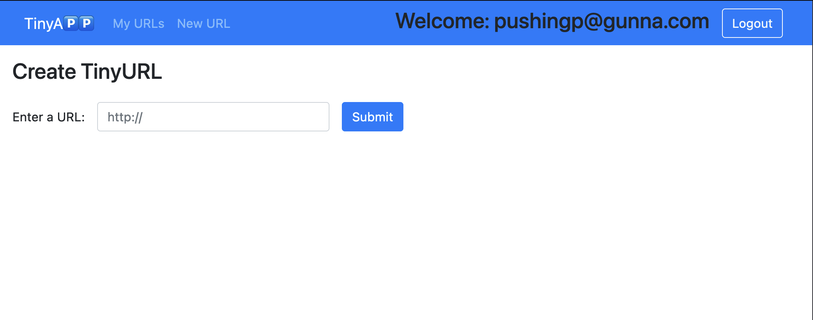
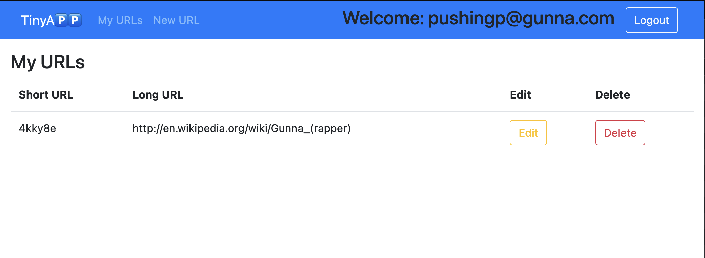

# TinyApp Project

TinyApp is a full stack web application built with Node and Express that allows users to shorten long URLs (à la bit.ly).

## Final Product

### Login Page

### Register Page

### Blank My URLs Page

### Create New URL Page

### Edit a URL Page

### Filled My URLs Page

## Dependencies

- Node.js
- Express
- EJS
- bcrypt
- body-parser
- cookie-session
- morgan

## Getting Started

- Install all dependencies (using the `npm install` command).
- Run the development web server using the `node express_server.js` command.